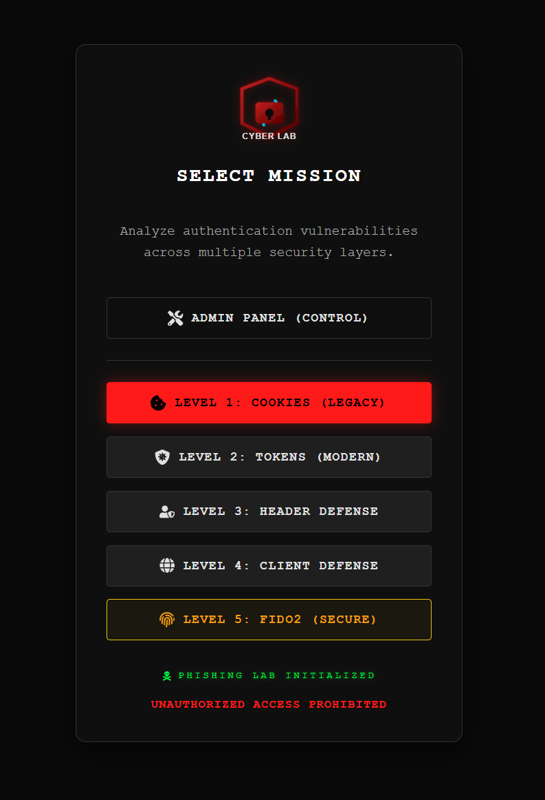

# Phishing Defense Lab - User Interface (Victim Client)

**Developed by Osamah Amer (2026)**
*Master's Thesis Project: Adversary-in-the-Middle (AiTM) Attack Analysis & Defense*

This is the frontend application for the Phishing Defense Lab. It simulates a realistic enterprise Single Page Application (SPA) designed to test various authentication protocols against modern phishing attacks, specifically Reverse Proxies like Evilginx2. The project is built with **React** and **Vite** to ensure high performance, modularity, and a modern development experience.

---

## Project Overview

<div align="center">
  
  <p><em>Figure 1: The "Security-Ops" Dashboard showing the 5 Security Levels</em></p>
</div>

The interface features a "Security-Ops" theme designed to simulate a high-security environment. It allows researchers to toggle between different "Security Levels" to observe how specific authentication mechanisms respond to interception attacks.

### Key Capabilities

* **Modular Architecture**: Clean separation between Pages, Logic (`authService`), and UI Components.
* **Real-Time Simulation**: Mimics real-world network delays, MFA challenges, and hardware interactions.
* **Environment Agnostic**: Supports seamless switching between Local Development (`localhost`) and Production (`Docker/Nginx`) environments using dynamic API configuration.

---

## Authentication Levels (Scenarios)

The lab is divided into 5 distinct levels, each representing a specific paradigm of web security and its corresponding vulnerability or defense mechanism:

### Vulnerable Scenarios

* **Level 1: Legacy Authentication (Cookies)**
    * **Mechanism**: Uses standard Form Data (`application/x-www-form-urlencoded`) and HttpOnly Cookies.
    * **Vulnerability**: Susceptible to **Session Hijacking**. AiTM proxies can automatically forward these cookies, allowing attackers to access the session without the password.

* **Level 2: Modern SPA (JWT)**
    * **Mechanism**: Uses JSON Web Tokens (JWT) stored in Local Storage or Session Storage.
    * **Vulnerability**: Susceptible to **Token Theft** via XSS and AiTM credential harvesting. Attackers can intercept the token during the initial handshake.

### Defended Scenarios

* **Level 3: Server-Side Defense (Header Analysis)**
    * **Mechanism**: The backend inspects HTTP headers such as `Host`, `X-Forwarded-Host`, and `X-Evilginx` signatures.
    * **Defense**: Detects inconsistencies typical of Reverse Proxies (e.g., mismatched Host headers) and blocks the connection before authentication completes.

* **Level 4: Client-Side Defense (Domain Guard)**
    * **Mechanism**: Active JavaScript protection that fetches a **Base64-obfuscated** configuration from the server.
    * **Defense**: Uses **Anti-Mirroring** logic. The client decodes the authorized origin (`atob`) and validates it against `window.location.hostname`. If a mismatch is found (indicating Evilginx is proxying the site), the page halts execution to prevent credential entry.

### Immune Scenario

* **Level 5: Hardware-Bound Authentication (FIDO2 / WebAuthn)**
    * **Mechanism**: Cryptographic login using Hardware Keys (e.g., YubiKey) or Platform Authenticators (TouchID/Windows Hello).
    * **Defense**: **Phishing Resistant**. The browser enforces origin binding at the protocol level, making it cryptographically impossible for an AiTM proxy to forge the signature required for login.

---

## Getting Started

### Prerequisites

* Node.js (v18 or higher)
* Docker (Optional, for production build simulation)

### 1. Local Development

Run the application in development mode with hot-reloading enabled.

```bash
# Navigate to the client directory
cd client

# Install dependencies
npm install

# Start the development server
npm run dev

```

*Access the application at: `http://localhost:5173*`

### 2. Production Build (Docker)

To simulate a real-world deployment using Nginx as a reverse proxy for the static assets.

```bash
# Build the Docker image
docker build -t phishing-lab-client .

# Run the container mapping port 80
docker run -p 80:80 phishing-lab-client

```

---

## Running Tests

The frontend includes a comprehensive testing suite combining **Vitest** for unit testing and **Playwright** for end-to-end (E2E) verification.

### Unit Tests (Vitest)

Checks individual component logic and isolated utility functions.

```bash
# Run all unit tests once
npm run test:unit

# Run in watch mode (for development)
npm run test:unit:watch

```

### End-to-End Tests (Playwright)

Simulates real user interactions (browsing, clicking, authenticating) across different browser engines.

```bash
# Run all E2E tests (Headless mode)
npm run test:e2e

# Run with interactive UI (See the browser actions live)
npm run test:e2e:ui

```

### Full Test Suite

Execute the entire pipeline (Unit + E2E):

```bash
npm test

```

---

## Project Structure

The codebase follows a scalable feature-based architecture:

```text
src/
├── api/             # Axios configuration (Interceptors & Base URL management)
├── components/      
│   ├── features/    # Dashboard & specific business logic components
│   ├── layout/      # Shared wrappers (Card, Footer)
│   └── ui/          # Reusable UI elements (InputGroup, Button, Checkbox)
├── pages/           # Route views (Home, Levels 1-5, Admin Panel)
├── services/        # Centralized Auth Logic (FIDO2, MFA, Token Management)
└── styles/          # CSS Variables, Global Themes, and Reset

```

## Future Research Directions

While the current implementation covers core AiTM defense mechanisms, future expansions could include:

* **Behavioral Biometrics**: Analyzing mouse movements and keystroke dynamics to detect automated attacks.
* **TLS Fingerprinting (JA3)**: Advanced server-side detection of non-standard client hellos used by proxy tools.
* **Mobile App Integration**: Extending FIDO2 tests to mobile native environments.

---

**Note**: This tool is developed strictly for **educational and research purposes**. It is designed to demonstrate how to *defend* against attacks, not how to conduct them.
